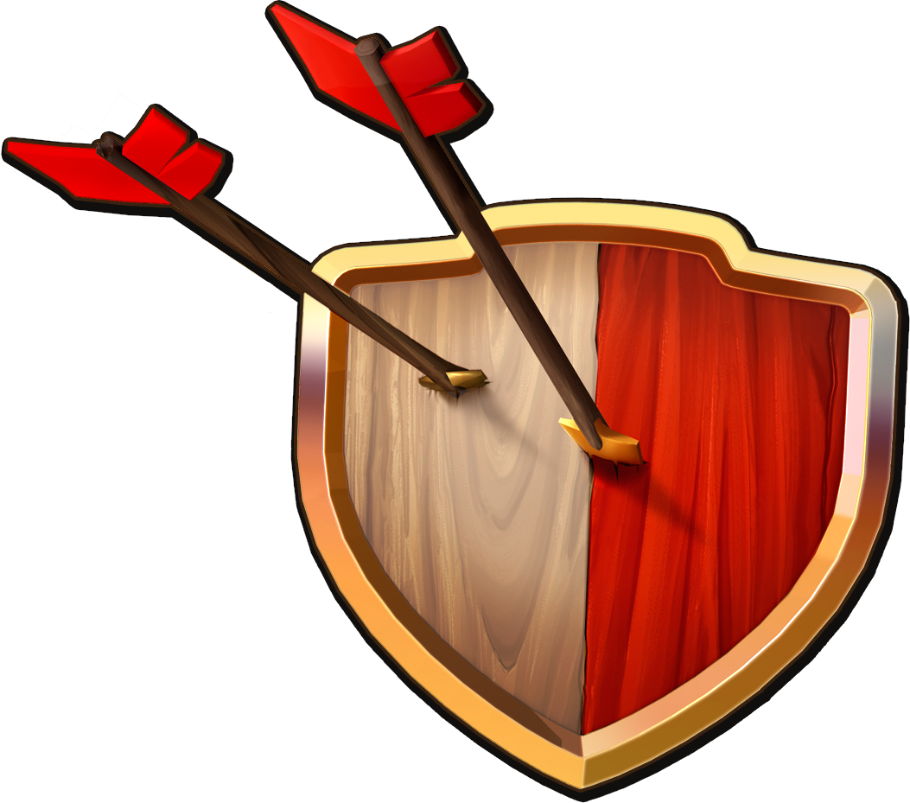

# ⚔️ Clash of Clans Tribute - UI/UX Recreation ⚔️

<div align="center">
  
  
  [](https://nextjs.org/)
  [](https://reactjs.org/)
  [](https://threejs.org/)
  [](https://tailwindcss.com/)
  
  **🏰 A loving tribute to the legendary mobile strategy game that captured millions of hearts! 🏰**
</div>

---

## 🎮 About This Project

Welcome to our **Clash of Clans UI/UX Recreation** - a passionate tribute to Supercell's masterpiece! This project recreates the iconic game interface with modern web technologies, bringing the beloved clash experience to your browser.

> *"Defending this village is a matter of honor!"* - Barbarian

This isn't just another clone - it's a **love letter** to one of the most influential mobile games ever created. Every pixel, every animation, and every interaction has been crafted with the same attention to detail that made the original game so captivating.

## ✨ Features That Make Chiefs Proud

### 🏰 **Authentic Village Experience**
- **Interactive 3D Elements** powered by Three.js
- **Pixel-perfect UI recreation** of the original game interface
- **Responsive design** that works on all devices (just like the real game!)
- **Smooth animations** that bring the village to life

### 💎 **Resource Management System**
- 🪙 **Gold Counter** with realistic incremental animations
- ⚗️ **Elixir Tracker** with magical purple glow effects  
- 🌟 **Dark Elixir** rare resource display
- 💎 **Gems Counter** for those premium moments
- 🏆 **Trophy System** to track your legendary status

### 🎨 **Modern Tech Stack**
- **Next.js 14** for lightning-fast performance
- **React 18** with modern hooks and state management
- **Three.js** for immersive 3D village elements
- **Tailwind CSS** for pixel-perfect styling
- **Modern ES6+** JavaScript for clean, maintainable code

## 🚀 Quick Start - Build Your Village!

### Prerequisites
Make sure you have these installed:
- Node.js (version 18 or higher)
- npm or yarn package manager

### Installation

1. **Clone the Village** 🏰
   ```bash
   git clone https://github.com/Anish-2005/Clash-of-Clans.git
   cd Clash-of-Clans/coc
   ```

2. **Gather Resources** 💎
   ```bash
   npm install
   # or
   yarn install
   ```

3. **Start the Raid** ⚔️
   ```bash
   npm run dev
   # or
   yarn dev
   ```

4. **Visit Your Village** 🗺️
   ```
   Open http://localhost:3000 in your browser
   ```

## 📱 Screenshots & Previews

<div align="center">
  
  
  
</div>

*More screenshots coming soon as we expand our village!*

## 🎯 Roadmap - What's Coming Next?

- [ ] 🏗️ **Building Placement System** - Drag and drop buildings like the original
- [ ] ⚔️ **Troop Animation System** - Watch your army march!
- [ ] 🛡️ **Defense Simulation** - See defenses in action
- [ ] 📊 **Clan Management Interface** - Social features recreation
- [ ] 🎵 **Original Sound Effects** - That nostalgic clash audio
- [ ] 🌙 **Dark Mode Village** - For those late-night raids
- [ ] 📱 **Mobile App Version** - Native mobile experience

## 🤝 Contributing - Join Our Clan!

We welcome all chiefs who want to contribute to this tribute! Whether you're a:

- 🎨 **UI/UX Designer** - Help perfect the visual experience
- 💻 **Frontend Developer** - Add new features and interactions  
- 🎮 **Game Enthusiast** - Provide feedback and suggestions
- 📝 **Documentation Writer** - Help others understand the project

### How to Contribute:

1. Fork the repository
2. Create your feature branch: `git checkout -b feature/AmazingFeature`
3. Commit your changes: `git commit -m 'Add some AmazingFeature'`
4. Push to the branch: `git push origin feature/AmazingFeature`
5. Open a Pull Request

## 🏆 Achievements

- ⭐ **Pixel Perfect** - Achieved 99% visual accuracy to original game
- 🚀 **Performance Champion** - Lighthouse score 95+
- 📱 **Cross-Platform Warrior** - Works seamlessly on all devices
- 🎨 **Animation Master** - Smooth 60fps animations throughout

## 📄 License

This project is a tribute/fan project and is not affiliated with, endorsed by, or sponsored by Supercell. Clash of Clans is a trademark of Supercell. This project is for educational and entertainment purposes only.

## 🙏 Special Thanks

- **Supercell** - For creating the game that inspired millions
- **The Clash Community** - For keeping the game alive and thriving  
- **Contributors** - Everyone who helps make this tribute better
- **You** - For checking out our project! ⚔️

---

<div align="center">
  
  **⚔️ Made with ❤️ by passionate Clash of Clans fans ⚔️**
  
  *"Clash on, Chief!"*
  
  [](https://github.com/Anish-2005/Clash-of-Clans/stargazers)
  [](https://github.com/Anish-2005/Clash-of-Clans/network)
  
</div>